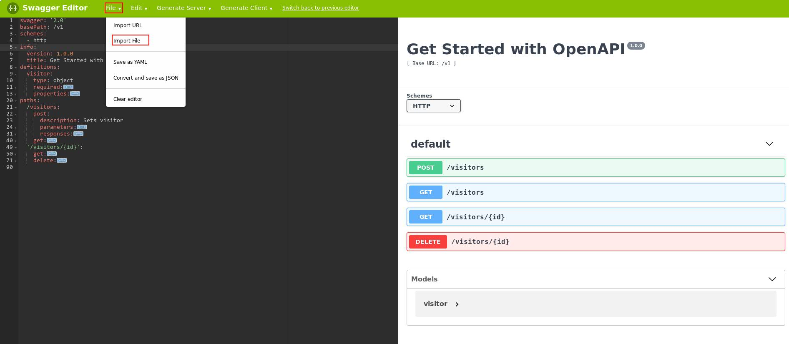

# Challenge 1: Draft an OpenAPI Specification

An [OpenAPI Specification (OAS)](https://github.com/OAI/OpenAPI-Specification) can be generated in a number of ways using different tools, for example:

- Created from scratch using a general purpose editor
- Created from scratch using a [swagger editor](https://swagger.io/swagger-editor/)
- Reverse engineered from your application by [inspecting the responses](https://inspector.swagger.io/builder) to commands
- Created from in-line comments inserted into the code of your server application that define the API for each endpoint, using the open source [swagger-inline](https://www.npmjs.com/package/swagger-inline) tool to generate the overall specification

We consider it ideal to use the 4th approach above - since by embedding the API endpoint documentation inline, any changes and updates can be picked up dynamically during a DevOps cycle. This is also beneficial whereby multiple versions of an application/service is available because the specification and API documentation is associated to that application/service version. Hence, for this challenge you will add the OpenAPI documentation inline to the application supplied, and then use the [swagger-inline](https://www.npmjs.com/package/swagger-inline) tool to generate the complete specification.

Before you start, take a look at the specification from an understanding and reference point: [OAS 2.0](https://github.com/OAI/OpenAPI-Specification/blob/master/versions/2.0.md) and [OAS 3.0.1](https://github.com/OAI/OpenAPI-Specification/blob/master/versions/3.0.1.md), as well as the examples given with the [swagger-inline](https://www.npmjs.com/package/swagger-inline) tool. Although OAS 3.0 is the latest version, not all tools yet support this - so for this challenge we will stick to the OAS 2.0 specification.

## Steps

1. Install `swagger-inline`

*Note: Installing globally so you can use the tool from the CLI.*

```
npm install -g swagger-inline
```

2. Add OpenAPI endpoints inline comments to the application API endpoints

The comments should be added to the sample app `server.js` file where the app API endpoints are defined. The [visitors POST API](https://github.ibm.com/developer-first-guild/get-started-openapi/blob/master/server.js#L38) comment has already being added for guidance.

The comments should be added above the following API endpoints:
- [visitors GET API](https://github.ibm.com/developer-first-guild/get-started-openapi/blob/master/server.js#L64)
- [visitors GET with ID API](https://github.ibm.com/developer-first-guild/get-started-openapi/blob/master/server.js#L84)
- [visitors DELETE API](https://github.ibm.com/developer-first-guild/get-started-openapi/blob/master/server.js#L112)

as these are the API endpoints for the app.

Use the [swagger-inline example](https://www.npmjs.com/package/swagger-inline#1-create-a-project), the [OAS 2.0](https://github.com/OAI/OpenAPI-Specification/blob/master/versions/2.0.md) and the [swagger pet store example](https://petstore.swagger.io/) as your guide.

*Note: The [swagger-inline base file](https://github.ibm.com/developer-first-guild/get-started-openapi/blob/master/openapi/openapiBase.yaml) is provided for you. You should add the `visitor` object to the `definitions` part of this file.*

3. Generate the OAS from the CLI

```
swagger-inline './server.js' --base './openapi/openapiBase.yaml' --format '.json' --out './openapi/openapi.json'
```
*Note: This will generate the OAS file `openapi.json` in the `<app_dir>/openapi` directory.*

4. Verify the OAS syntax

`<app_dir>/test/testSpec.js` is a wrapper around [swagger-parser](https://www.npmjs.com/package/swagger-parser), which is a tool that can validate an OAS. You can run the syntax verification as follows:

```
node ./test/testSpec.js <path_to_the_generated_openapi_spec>
```

For example:
```
node ./test/testSpec.js ./openapi/openapi.json
```

The response should be similar to the following:
```
SUCCESS! API name: Get Started with OpenAPI, Version: 1.0.0
```

5. View the OAS

Now that you have an OAS generated and the syntax validated, you need to view it. There are a number of tools or editors you can use and in this challenge we are suggesting to use the [online Swagger Editor](https://editor.swagger.io). We consider it ideal because its requires no installation and it also renders API documentation in "real time" on a split screen in the editor. This provides you with the capability to alter the specification and APIs on the fly, and immediately see the results.

Load the specification by clicking on "File --> Import File" in the main menu of the editor as shown:



You should notice the specification in the editor contain the following:
- Visitor object:
  - Properties: should be 'name' and 'id' of type `string`
- Get visitors:
  - Path Parameter: should be a `string` which is the UUID of the visitor object that is to be retrieved
  - Ideally, an example should be given with sample data
  - Response:
    - 200 - returns the visitor `object`
    - 400 - message `object` that id not provided
    - 404 - message `object` that the visitor does not exist with that id
- Get visitors:
  - Response:
    - 200 - returns a `object array` of all visitors. Empty `array` if no visitors set
- Post Visitors:
  - Body Parameter: should be a visitor `object` which has the `name` property set
  - Ideally, an example should be given with sample data
  - Response:
    - 201 - success, returns the visitor `object` that was added with the `id` property set with the generated UUID
    - 409 - message `object` that shows duplicate error message
- Delete Visitors:
  - Path Parameter: should be a `string` which is the UUID of the visitor object that is to be deleted
  - Ideally, an example should be given with sample data
  - Response:
    - 204 - success
    - 400 - message `object` that id not provided
    - 404 - message `object` that the visitor does not exist with that id

You should also notice the API documentation rendered by the editor from your OAS, similar to that shown above on the right hand panel.

## Completion

OAS is generated and you verified its syntax using `swagger-parser`.

## Follow-on

Render API documentation using the OAS you generated and use the documentation to prove that the specification matches the endpoints.
